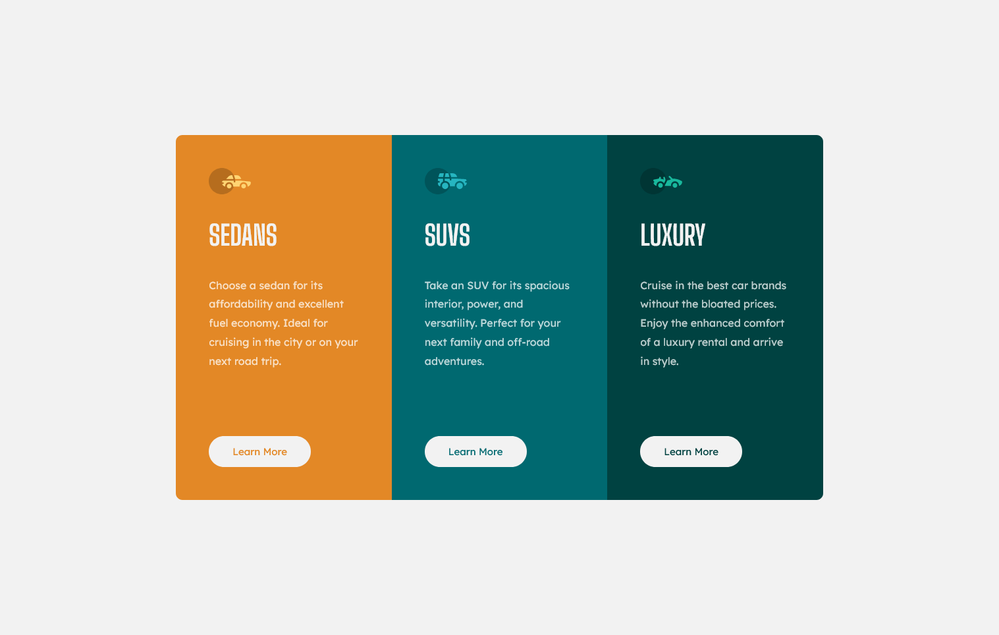

# Frontend Mentor - 3-column preview card component solution

This is a solution to the [3-column preview card component challenge on Frontend Mentor](https://www.frontendmentor.io/challenges/3column-preview-card-component-pH92eAR2-). Frontend Mentor challenges help you improve your coding skills by building realistic projects.

## Table of contents

-   [Overview](#overview)
    -   [The challenge](#the-challenge)
    -   [Screenshot](#screenshot)
    -   [Links](#links)
-   [My process](#my-process)
    -   [Built with](#built-with)
    -   [What I learned](#what-i-learned)

## Overview

### The challenge

Users should be able to:

-   View the optimal layout depending on their device's screen size
-   See hover states for interactive elements

### Screenshot




### Links

-   Live Site URL: [HERE](https://boisterous-otter-129ce8.netlify.app/)

## My process

### Built with

-   Semantic HTML5 markup
-   CSS custom properties
-   Flexbox
-   CSS Grid
-   Desktop-first workflow

### What I learned

Some of the things I learnt include understanding and knowing how to use multiple media queries and determining when to use either flexbox or grid and which of them is most appropriate for a certain style.

```css
@media (max-width: 56em) {
    /* Code */
}
@media (max-width: 32em) {
    /* Code */
}
```
